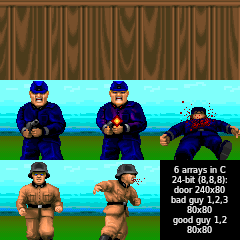
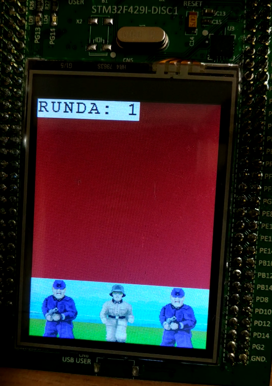

# O projekcie
# About the project
This is a simple game that I prepared for classes at the university. It was developed for the STM32F429I-DISCO development board. The gameplay consists of shooting random characters, good and bad, appearing every round. The player has limited time to decide which character he wants to shoot. Depending on your choice, you can earn or lose points. For getting enough points, the number of lives increases by 1. When the time to make a decision is over, bad characters who have not been shot shoot at the player, which reduces the number of lives remaining. If the number of lives decreases to 0, the game stops, then it must be restarted. Otherwise, the next round begins.
# Components used
I only used STM32F429I-DISCO and 3 buttons. They were successively connected to pins PE2, PE4 and PE6 (and to 3V). Each of them is used to shoot a different character.
# Display images
I devoted the most time to this project to how to display images on the display. For this purpose I used the BSP_LCD_DrawBitmap () function from the display driver stm32f429i_discovery_lcd.c. I converted the previously prepared images into arrays in the C language and attached them to the project.

# Shot detection
I used the interrupt mechanism to detect the shot. Each of the three buttons breaks the main program loop and calls the interrupt handler. If the program is in shooting stage, it changes pictures and points. Otherwise the shot is ignored.
